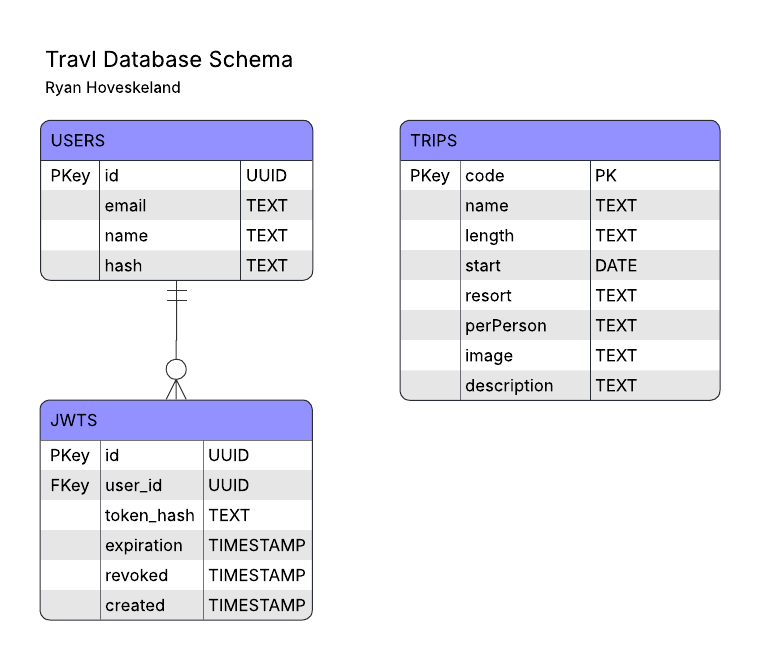

# Database Enhancement

## Overview

This artifact is the CRUD functionality of the Travlr Getaways application, which communicates with a PostgreSQL database to read, add, update, and manage records. I originally implemented this project using the MEAN stack, so this enhancement involved both migrating the backend to Go and replacing MongoDB with PostgreSQL.

I included this artifact in my ePortfolio because most software applications rely on CRUD functionality, and demonstrating my ability to replace both the database engine and backend implementation without requiring changes to the front end is a good way to show that I have a solid understanding of databases and their place within the overall technology stack.

Some particularly notable components of this enhancement are my use of Goose migrations to manage database schema changes and my `api/requests.go` and `api/responses.go` files, which define request and response shapes for consistent request decoding and response marshaling.

## Original Design

The original implementation used MongoDB as its database layer and Express as its backend framework. While the application was functional, it relied on a document-oriented database and Javascript-based backend architecture. As part of this enhancement, I redesigned the data layer to use PostgreSQL while preserving compatibility with the existing Angular front end. The schema is defined in the following image.



A major goal of this enhancement was demonstrating that the data layer and application layer could be replaced independently as long as the API contract remained consistent.

## Database Design and Architecture

Migrating from MongoDB to PostgreSQL required redesigning the application’s data model around a relational schema. Rather than relying on flexible document structures, PostgreSQL required explicit table definitions, relationships, and SQL queries.

To support this migration, I used Goose migrations to create and manage the database schema through version-controlled SQL artifacts. This approach preserves a clear history of schema evolution while also making deployment and database initialization repeatable on new systems.

```
-- +goose Up
CREATE TABLE trips (
	code TEXT PRIMARY KEY NOT NULL,
	name TEXT UNIQUE NOT NULL,
	length TEXT NOT NULL,
	start DATE NOT NULL,
	resort TEXT NOT NULL,
	perPerson INT NOT NULL,
	image TEXT NOT NULL,
	description TEXT NOT NULL
);

-- +goose Down
DROP TABLE trips;
```

I also used SQLC to generate Go code from SQL queries. This allowed me to maintain SQL as the authoritative definition of database operations while still benefiting from strong typing in Go.

Another important architectural decision was the creation of dedicated request and response structures in `api/requests.go` and `api/responses.go`. These structures set a clear boundary between external JSON payloads and internal application logic, simplifying request processing and reducing the likelihood of invalid data entering the system.

## Enhancements and Improvements

This enhancement improved the project in a lot of important ways.

One significant improvement involved the Edit Trip page. In the original implementation, a bug prevented the stored trip date from populating correctly in the date input field. During the migration process, I noticed that Angular expected a specific response format that the backend was not providing. I corrected this issue by recreating the response structure Angular expected and building a helper function to transform database records into the correct format.

Another big improvement was the addition of the `jwts` table within the PostgreSQL schema. This table allowed me to implement stateful JWT management and allowed issued tokens to be tracked, expired, and eventually revoked. In this implementation, tokens are issued with a one-hour expiration period. By comparison, the original implementation relied on JWTs that persisted indefinitely unless manually removed from the browser. The new approach provides significantly better control over authentication state and improves overall system security.

## Challenges and Problem Solving

One of the most interesting challenges involved RSA-based JWT signing. Because RSA requires a public-private keypair, the application needed access to cryptographic keys in order to function correctly. Committing those credentials to source control was not an acceptable solution, but I also wanted to avoid introducing unnecessary setup steps for new deployments.

My solution was to create a helper function that checks for the presence of a keypair when the server starts. If no keypair is found, the application automatically generates and stores one. This preserves security while also providing a much smoother deployment experience.

Another lesson came from the migration process itself. Major architectural changes often force developers to examine assumptions that have existed within a system for a long time. Because migrating from MongoDB to PostgreSQL required me to analyze the application’s data structures in detail, I was able to discover the date-handling bug in the Edit Trip page that had previously gone unnoticed. The migration itself became an opportunity to improve application quality beyond the database layer.

## Reflection

This enhancement taught me a lot about relational database design, schema management, and the challenges involved in replacing core components of an existing system. Migrating from MongoDB to PostgreSQL required evaluating the tradeoffs between document-oriented and relational database systems while redesigning the data layer to support structured schemas and SQL-based workflows.

Probably the most valuable lesson was seeing how effective abstraction can be within a software system. Despite replacing both the database engine and backend implementation, the Angular front end required basically no modification because the API contract stayed consistent. That experience reinforced the importance of clearly defined interfaces and separation of concerns when designing maintainable software systems.

Overall, this enhancement strengthened my understanding of database architecture, API design, deployment considerations, and large-scale system migration while producing a more robust and maintainable implementation of the Travlr Getaways application.
